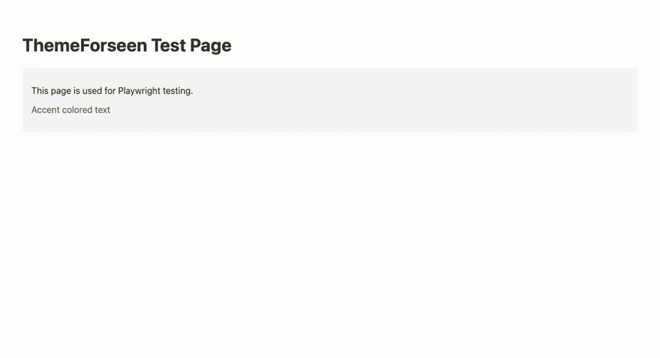

# ThemeForseen


A live color theme and font pairing preview drawer for websites. Browse and preview different color schemes and font combinations in real-time.



More details on [YouTube](https://www.youtube.com/watch?v=h4MdlSp9Kg8).

## Features

- **CSS Variables** - Sets `--color-primary`, `--font-heading`, etc. on `<html>` for any CSS to consume
- **Live Color Theme Preview** - Curated color palettes with instant visual feedback
- **Font Pairing Preview** - Thoughtful, beautiful font combinations
- **Light & Dark Mode Support** - Separate themes for each mode
- **Dev Server** - Write CSS variables directly to your project files with one click
- **Smart Project Detection** - Auto-detects Next.js, Vite, Astro, and other frameworks
- **Page API** - Open the drawer, set defaults and follow selections from your own code
- **Keyboard Navigation** - Arrow keys to browse options
- **Mouse Wheel Support** - Scroll through themes and fonts
- **Framework Agnostic** - Works with plain CSS, Tailwind, or any CSS framework

## Installation

```bash
npm install theme-forseen
```

## Setup -- CSS variables

Use these CSS variables in your stylesheets:

```
--color-primary
--color-primary-shadow
--color-accent
--color-accent-shadow
--color-bg
--color-card-bg
--color-text
--color-extra
--font-heading
--font-body
```

## Setup -- Wiring this up in different systems

### CDN On Simple HTML Page

```html
<!DOCTYPE html>
<html>
  <style>
    body {
      color: var(--color-text);
      background: var(--color-bg);
      font-family: var(--font-body);
    }
    h1 {
      color: var(--color-primary);
      font-family: var(--font-heading);
    }
  </style>
  <script type="module" src="https://unpkg.com/theme-forseen"></script>
  <body>
    <h1>Hello World</h1>
    <p>This is my first HTML page.</p>
  </body>
</html>
```

### Tailwind Vite App

- Create a Vite app:

```bash
npm create vite@latest my-app -- --template vanilla
cd my-app
```

- Install Tailwind and ThemeForseen:

```bash
npm install tailwindcss @tailwindcss/vite theme-forseen
```

- Create `vite.config.js`:

```js
import tailwindcss from "@tailwindcss/vite";
export default { plugins: [tailwindcss()] };
```

- Replace `index.html`:

```html
<!doctype html>
<html lang="en">
  <head>
    <meta charset="UTF-8" />
    <link rel="icon" type="image/svg+xml" href="/vite.svg" />
    <meta name="viewport" content="width=device-width, initial-scale=1.0" />
    <title>my-app</title>
  </head>
  <body class="bg-bg text-primary">
    <div id="app"></div>
    <script type="module" src="/src/main.js"></script>
  </body>
</html>
```

- Replace `src/main.js`:

```js
import './style.css'
import 'theme-forseen'

document.querySelector('#app').innerHTML = `
<div class="min-h-screen flex items-center justify-center p-8">
  <div class="bg-card-bg rounded-2xl p-8 max-w-md shadow-xl">
    <h1 class="font-heading text-4xl text-primary">Theme Forseen</h1>
    <p class="font-body mt-4 text-text">Preview color themes and font pairings in real-time.</p>
    <div class="mt-6 flex gap-3">
      <button class="bg-primary text-bg px-4 py-2 rounded-lg font-semibold border-2 border-primary-shadow hover:brightness-95 hover:cursor-pointer">Get Started</button>
      <button class="bg-accent text-bg px-4 py-2 rounded-lg font-semibold border-2 border-accent-shadow hover:brightness-95 hover:cursor-pointer">Learn More</button>
    </div>
  </div>
</div>
`
```

- Replace `src/style.css`:

```css
@import "tailwindcss";

@theme inline {
  --color-primary: var(--color-primary);
  --color-primary-shadow: var(--color-primary-shadow);
  --color-accent: var(--color-accent);
  --color-accent-shadow: var(--color-accent-shadow);
  --color-bg: var(--color-bg);
  --color-card-bg: var(--color-card-bg);
  --color-text: var(--color-text);
  --color-extra: var(--color-extra);
  --font-heading: var(--font-heading);
  --font-body: var(--font-body);
}
```

- Run the dev server:

```bash
npm run dev
```

## Usage

The drawer auto-initializes when you import the module—no setup code needed.

### With a Bundler (Vite, Webpack, Parcel, etc.)

```html
<script type="module">
  import "theme-forseen";
</script>
```

### Without a Bundler (plain HTML)

If you're serving static HTML files without a bundler, use the full path:

```html
<script type="module">
  import "/node_modules/theme-forseen/dist/index.js";
</script>
```

Or use a CDN:

```html
<script type="module">
  import "https://unpkg.com/theme-forseen/dist/index.js";
</script>
```

### SvelteKit

```svelte
<script>
  import 'theme-forseen';
</script>
```

### React

```jsx
import "theme-forseen";

function App() {
  return <div>Your app</div>;
}
```

## Styling with CSS Variables

ThemeForseen sets CSS variables on `<html>` at runtime. Use them in your CSS however you like.

### Plain CSS

No config needed. Just use the variables:

```css
h1 {
  color: var(--color-primary);
  font-family: var(--font-heading);
}

body {
  color: var(--color-text);
  background: var(--color-bg);
  font-family: var(--font-body);
}

.card {
  background: var(--color-card-bg);
  border: 1px solid var(--color-accent);
}
```

### Tailwind CSS

To use Tailwind utility classes, map the CSS variables in your config.

#### Tailwind v4 (CSS-first config)

Add this to your main CSS file:

```css
@import "tailwindcss";

@theme inline {
  --color-primary: var(--color-primary);
  --color-primary-shadow: var(--color-primary-shadow);
  --color-accent: var(--color-accent);
  --color-accent-shadow: var(--color-accent-shadow);
  --color-bg: var(--color-bg);
  --color-card-bg: var(--color-card-bg);
  --color-text: var(--color-text);
  --color-extra: var(--color-extra);
  --font-heading: var(--font-heading);
  --font-body: var(--font-body);
}
```

The `inline` keyword tells Tailwind these reference external runtime variables.

#### Tailwind v3 (JS config)

Update your `tailwind.config.js`:

```js
export default {
  theme: {
    extend: {
      colors: {
        primary: "var(--color-primary)",
        "primary-shadow": "var(--color-primary-shadow)",
        accent: "var(--color-accent)",
        "accent-shadow": "var(--color-accent-shadow)",
        bg: "var(--color-bg)",
        "card-bg": "var(--color-card-bg)",
        text: "var(--color-text)",
        extra: "var(--color-extra)",
      },
    },
    fontFamily: {
      heading: ["var(--font-heading)", "sans-serif"],
      body: ["var(--font-body)", "sans-serif"],
    },
  },
};
```

#### Using Tailwind classes

Then use in your markup:

```html
<h1 class="font-heading text-primary">Hello World</h1>
<p class="font-body text-text bg-bg">Body text</p>
```

### Other CSS Frameworks

Any CSS framework that supports CSS variables will work. Just reference the variables (see [CSS Variables Reference](#css-variables-reference) below).

## How to Use the Drawer

1. **Open**: Click the tab on the right side of the screen
2. **Browse themes**: Click one to apply it; the arrow keys and the mouse wheel step through the list. Search by name, color name or hex, narrow by tag, or show only what you have starred or liked
3. **Browse fonts**: Click a pairing to apply it, or one face of it to use that face alone; the ⇄ swaps heading and body. Search by name, narrow by heading style with the pills and by body style with the menu
4. **Light / Dark**: The switch beside the tabs. Each mode keeps its own theme
5. **Preview on This Site**: Closes the drawer so you can look at the page with the selection applied; the tab brings it back
6. **Apply to Project**: Writes the selection to your project when the [dev server](#dev-server) is running, and otherwise shows the two files to copy or save

The two tabs put a column away or bring it back. One stays out at least, and on a phone one shows at a time.

### Skinning the drawer

The drawer draws itself with its own cream and night palettes. A host page can change any of them by setting custom properties on the element:

```css
theme-forseen {
  --tf-font: 'Geist', system-ui, sans-serif; /* the drawer's face */
  --tf-width: 480px;                          /* when floating */
  --tf-radius: 10px;

  /* surfaces and ink */
  --tf-bg: #ede3d1;
  --tf-surface: #f7f0e3;
  --tf-surface-2: #e2d6bf;
  --tf-text: #15140f;
  --tf-muted: #6b6358;
  --tf-line: rgba(21, 20, 15, 0.16);

  /* the keys */
  --tf-key: #1d262a;       /* the tab, the switch track, Preview's outline */
  --tf-on-key: #f3ead9;
  --tf-teal: #19606b;      /* pressed tabs and pills */
  --tf-on-teal: #fff;
  --tf-orange: #f0562b;    /* the selection, the switch knob, Apply */
  --tf-on-orange: #15140f;

  /* the stripes in the header's cloud, top to bottom */
  --tf-cloud-1: #04394a;
  --tf-cloud-2: #057276;
  --tf-cloud-3: #fb4a1d;
  --tf-cloud-4: #e88a16;
  --tf-cloud-5: #92560e;
}
```

The drawer's night palette applies while the dark mode is selected, so a value set on the element holds in both modes; set it under your own dark-mode selector to vary it.

## Page API

The drawer adds itself to the page when you import the module. To configure it, put the element in your markup yourself and the module will use that one.

```html
<theme-forseen default-theme="Golden Hour" default-fonts="Inter & Geist"></theme-forseen>
```

### Attributes

| Attribute       | Description                                                                         |
| --------------- | ----------------------------------------------------------------------------------- |
| `default-theme` | Name of the theme to apply, in both modes, when the visitor has not selected one    |
| `default-fonts` | Name of the font pairing to apply when the visitor has not selected one             |
| `open`          | Present while the drawer is open. Add or remove it to open or close the drawer      |

Names are matched without regard to case. A name that is not in the collection logs a warning and the first entry is used. Defaults are read once, when the element starts.

### Methods

```js
const drawer = document.querySelector("theme-forseen");

drawer.open();
drawer.close();
drawer.toggle();
```

### State

`state` is what is applied to the page right now. It is `null` until the collection has loaded.

```js
drawer.state;
// {
//   mode: "light",
//   theme: { name: "Golden Hour", colors: { primary: "#...", background: "#...", ... } },
//   fonts: { heading: "Inter", body: "Geist" },
//   open: false
// }
```

### Events

`themeforseen:change` is dispatched on the element whenever `state` changes: once when the page is first painted, then on every selection, mode change, open and close. It bubbles, so you can listen on `document`. `event.detail` is the new state.

```js
document.addEventListener("themeforseen:change", (event) => {
  console.log(event.detail.theme.name, event.detail.mode);
});
```

### Changing the mode from your page

If your site has its own light/dark control, tell the drawer about a change and it repaints the page with the selection for that mode, whether or not the drawer is open:

```js
window.dispatchEvent(new CustomEvent("darkmode-change", { detail: { dark: true } }));
```

Setting `color-scheme` on `<html>` has the same effect.

### The collection on its own

The themes and font pairings are available without the element, for build scripts and server code:

```js
import { colorThemes, fontPairings, getAllThemeTags } from "theme-forseen/data";
```

The element fetches this file by itself, separately from its own code.

## Dev Server

The dev server lets you write CSS variables directly to your project files with one click.

### Quick Start

```bash
# In your project directory
npx theme-forseen
```

This starts a local server that the drawer's **Apply to Project** button writes through: the selected theme's variables and the selected fonts go directly into your CSS file.

### How It Works

1. **Start the server** in your project directory
2. **Browse** in the drawer as usual
3. **Apply to Project** - the colors and the fonts are written to your CSS file
4. **No server running?** The button shows the two files to copy or save instead

### Smart Project Detection

The server automatically detects your project type and finds the right CSS file:

| Project Type | CSS File Location                          |
| ------------ | ------------------------------------------ |
| Next.js      | `src/app/globals.css` or `app/globals.css` |
| Vite         | `src/index.css` or `src/style.css`         |
| Astro        | `src/styles/global.css`                    |
| SvelteKit    | `src/app.css`                              |
| Nuxt         | `assets/css/main.css`                      |
| Plain HTML   | Parses `index.html` for stylesheet links   |

### Plain HTML Projects

For plain HTML projects, the server is extra smart:

- **One `<link rel="stylesheet">`** - Writes to that CSS file
- **No stylesheet but has `<style>` tag** - Appends to the inline styles
- **Multiple stylesheets** - Uses the first one (or looks for `main.css`, `style.css`, etc.)

### Generated CSS

The server writes CSS variables in this format:

```css
/* ThemeForseen Colors - Light Mode */
:root {
  --color-primary: #ff3366;
  --color-primary-shadow: #cc2952;
  --color-accent: #ffd600;
  --color-accent-shadow: #ccab00;
  --color-bg: #ffffff;
  --color-card-bg: #fff8f0;
  --color-text: #1a1a1a;
  --color-extra: #ff6b00;
}
/* End ThemeForseen */
```

And the fonts, as a second block:

```css
/* ThemeForseen Font */
:root {
  --font-heading: "Playfair Display", Georgia, "Times New Roman", serif;
  --font-body: "Inter", -apple-system, BlinkMacSystemFont, "Segoe UI", system-ui, sans-serif;
}
/* End ThemeForseen */
```

A later Apply replaces each block rather than adding another.

### Server Options

```bash
npx theme-forseen          # Start the server
npx theme-forseen --help   # Show help
npx theme-forseen -v       # Show version
```

The server runs on port 3847 by default.

## CSS Variables Reference

### Colors

| Variable                                 | Description                        |
| ---------------------------------------- | ---------------------------------- |
| `--color-primary`                        | Primary brand color                |
| `--color-primary-shadow`                 | Darker shade of primary            |
| `--color-accent`                         | Accent/secondary color             |
| `--color-accent-shadow`                  | Darker shade of accent             |
| `--color-bg`                             | Background color                   |
| `--color-card-bg`                        | Card/surface background            |
| `--color-text`                           | Main text color                    |
| `--color-extra`                          | Additional accent color            |
| `--color-h1`, `--color-h2`, `--color-h3` | Heading colors                     |
| `--color-heading`                        | General heading color (same as h1) |
| `--primary-color`                        | Alias for `--color-primary`        |
| `--secondary-color`                      | Alias for `--color-accent`         |

### Fonts

| Variable         | Description                |
| ---------------- | -------------------------- |
| `--font-heading` | Font family for headings   |
| `--font-body`    | Font family for body text  |
| `--heading-font` | Alias for `--font-heading` |
| `--body-font`    | Alias for `--font-body`    |

## Customization

Add your own themes by editing `src/themes.ts`. Add them at the end of the list: selections are stored by position, so inserting one higher up moves every visitor's selection.

```typescript
export const colorThemes: ColorTheme[] = [
  {
    name: "My Custom Theme",
    light: {
      primary: "#FF0000",
      primaryShadow: "#CC0000",
      accent: "#00FF00",
      accentShadow: "#00CC00",
      background: "#FFFFFF",
      cardBackground: "#F5F5F5",
      text: "#333333",
      extra: "#0000FF",
      h1Color: "primary",
      h2Color: "primary",
      h3Color: "accent",
    },
    dark: {
      // dark mode colors...
    },
  },
];
```

Rebuild after changes:

```bash
npm run build
```

## Development

```bash
# Install and build
npm install
npm run build

# Watch mode
npm run dev
```

### Local Testing

To test the drawer locally:

```bash
npx serve . -l 3000
```

Then open http://localhost:3000/tests/fixtures

To capture the drawer as a reviewer would see it, with the fixtures served:

```bash
node scripts/shoot-drawer.mjs http://localhost:3000/tests/fixtures/defaults.html drawer.png        # by day
node scripts/shoot-drawer.mjs http://localhost:3000/tests/fixtures/defaults.html drawer.png dark   # by night
node scripts/shoot-page.mjs http://localhost:3000/tests/fixtures/defaults.html phone.png 390 844 open
```

### Running Tests

```bash
npm test           # Run all tests
npm run test:ui    # Run with Playwright UI
npm run test:headed # Run in headed browser
```

## Contributing

Contributions welcome!

1. Fork the repo
2. Create a feature branch
3. Make your changes
4. Open a PR to `main`

PRs require all tests to pass before merging. Tests run automatically when you open a PR.

## How It Works

ThemeForseen sets [CSS custom properties](https://developer.mozilla.org/en-US/docs/Web/CSS/--*) (CSS variables) on `<html>` when you select themes. Your CSS references these variables, so colors and fonts update instantly. Works with plain CSS, Tailwind, or any CSS framework.

Built as a vanilla [Web Component](https://developer.mozilla.org/en-US/docs/Web/API/Web_components), so it works with any framework (React, Vue, Svelte, Astro, plain HTML, etc.).

## License

MIT
